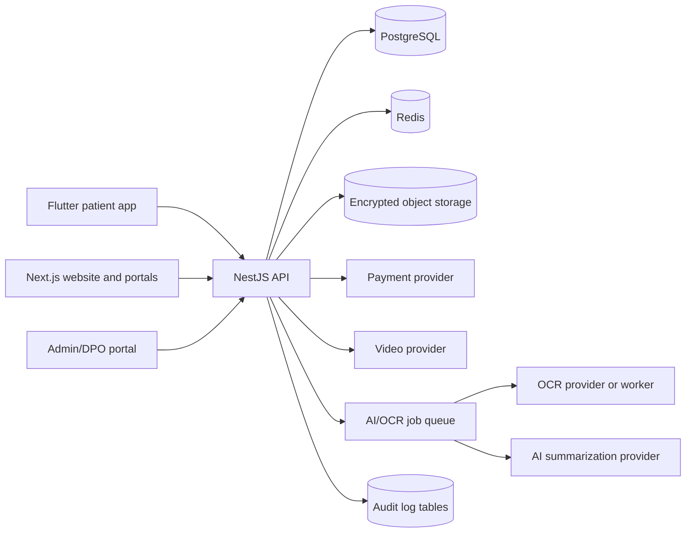

# System Overview

## Architecture Style

Use a modular monolith for the MVP backend. The code is one deployable API, but the domain is separated into modules with strict boundaries. This keeps the first version simpler to secure and audit while allowing future extraction of heavy workloads such as AI document processing, reminders or messaging.

## Runtime Components

- Flutter mobile app: patient-first workflows, document upload, reminders and post-op journal.
- Next.js web: public procedure/clinic search, clinic portal and admin back-office.
- NestJS backend: REST API, WebSocket gateway, workflow orchestration and jobs.
- PostgreSQL: transactional source of truth for users, clinics, consent, quotes, bookings and audit metadata.
- Object storage: encrypted medical documents and generated summaries.
- Redis: queues, reminders, throttling, short-lived tokens and WebSocket fanout.
- AI/OCR pipeline: isolated processing path with prompt/model version logging and no training by default.

## MVP Data Flow

1. Patient creates an account and accepts separate consents.
2. Patient searches procedures and verified clinics.
3. Patient uploads documents to encrypted storage.
4. Backend creates OCR and AI summary jobs.
5. Patient reviews summary and chooses what to share.
6. Clinic receives only the consented request, summary and documents.
7. Clinic proposes consultation or quote.
8. Patient pays deposit through PSP.
9. Booking, medication reminders and post-op journal continue inside the platform.

## Core Architectural Rules

- Consent is checked before document access, AI processing and clinic visibility.
- Sensitive document content is stored outside PostgreSQL; PostgreSQL stores metadata and access rules.
- Every sensitive action writes an audit log with actor, purpose, resource, timestamp and reason.
- AI output is never treated as authoritative; source documents and human validation remain visible.
- Contact masking must not hide medically necessary safety information.
- Start with PostgreSQL search for MVP; add OpenSearch only when search complexity demands it.

