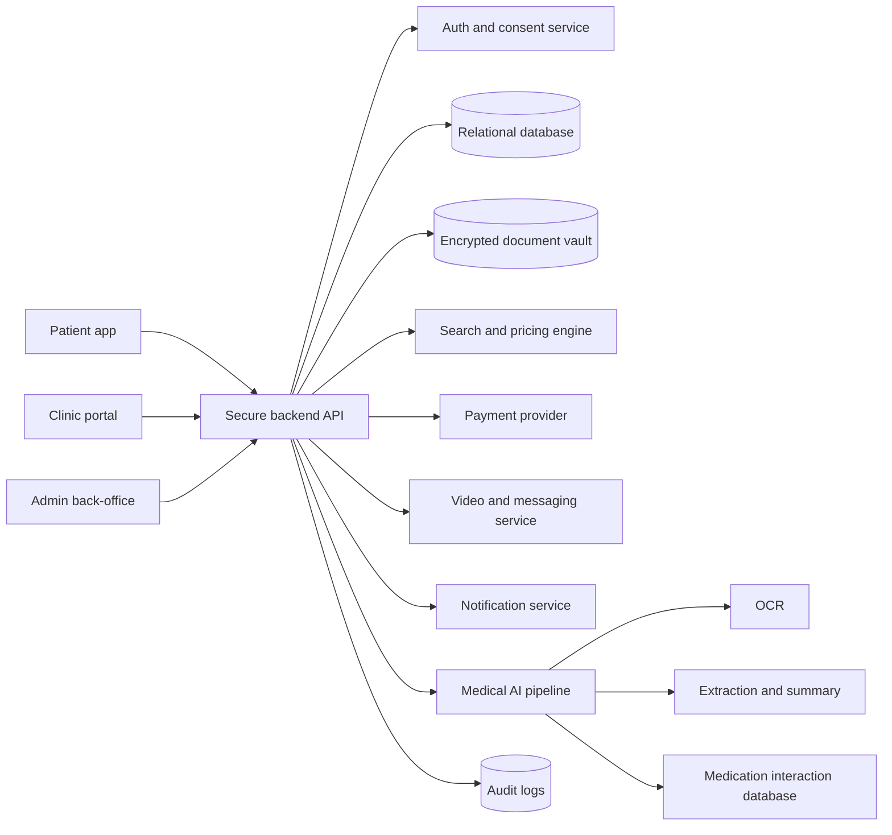

# Project Requirements Document - Medical Tourism Platform and AI Medical Assistant

Version: 1.1  
Date: 21 June 2026  
Target region: European Union, EEA and United Kingdom  
Provisional project name: MedTour AI  
Status: Product, functional, technical and regulatory requirements document

> Important note: this document is a project requirements specification. It does not replace legal, medical, tax or regulatory advice. Before commercial launch in the EU or UK, the project must be reviewed by a healthcare technology lawyer, a Data Protection Officer, a medical device regulatory expert and a clinical safety officer.

---

## 1. Executive Summary

The project aims to create a mobile and web platform that allows patients to compare healthcare providers in their own country or abroad, securely send medical documents, organise a consultation with a partner clinic, book treatment, and then follow their preparation and recovery.

The platform is built around two main modules:

1. **Secure medical tourism marketplace**
   - Patients search for operations, treatments or medical procedures.
   - They compare hospitals and clinics by price, country, quality indicators, availability, accreditation, verified reviews and estimated total cost.
   - The platform estimates the full cost: procedure, travel, accommodation, insurance, visa, companion, local transport and post-operative follow-up.
   - Patients securely share medical documents with clinics after explicit consent.
   - Messaging and video consultation are handled inside the platform, with pre-booking anonymisation to reduce commercial bypass.
   - Clinics can evaluate documents, accept or reject cases, issue quotes, schedule consultations and propose surgery dates.

2. **AI medical document scanner and patient follow-up assistant**
   - Patients scan, upload and analyse medical documents.
   - The AI generates a concise medical summary with references to the source pages.
   - The summary highlights allergies, medical history, diagnoses, current treatments, test results and points requiring attention.
   - Patients can share a 1 to 2 page summary with doctors instead of sending 20 or more pages.
   - Patients can track medication schedules, reminders, adherence, side effects and potential drug interactions.
   - Clinics can monitor post-operative medication and recovery progress when the patient has given consent.

The product positioning must remain clear: the platform helps organise care, structure medical information and support follow-up, but it does not replace diagnosis, prescription or medical decision-making by a licensed healthcare professional.

---

## 2. Project Objectives

### 2.1 Business Objectives

- Build a trusted medical tourism marketplace for patients in the EU, EEA and UK.
- Generate revenue through commissions on booked procedures, clinic subscriptions, premium medical file services, insurance partnerships and travel services.
- Reduce platform bypass through an integrated workflow for quotes, communication, payment, booking and post-operative follow-up.
- Build a verified network of clinics assessed with objective quality criteria.
- Become a trusted intermediary between patients, clinics, doctors and travel service providers.

### 2.2 Patient Objectives

- Quickly find a clinic that can perform a selected procedure.
- Compare the full estimated cost across several countries.
- Understand risks, prerequisites and documents needed before surgery.
- Share medical documents without unnecessary exposure of sensitive data.
- Generate a clear medical summary instead of sending many unstructured documents.
- Receive medication reminders and post-operative follow-up support.
- Share their history with a new doctor quickly and securely.

### 2.3 Clinic Objectives

- Receive qualified patient requests with structured medical files.
- Reduce administrative time during pre-assessment.
- Organise consultations and quotes in a secure workspace.
- Monitor medication adherence and key post-operative signs when consent is provided.
- Keep an auditable record of decisions, messages, documents and consent.

---

## 3. Project Scope

### 3.1 MVP Scope

- Patient mobile app or responsive web app.
- Clinic web portal.
- Administrator back-office.
- Medical procedure catalogue.
- Clinic search and comparison.
- Estimated total cost calculator.
- Patient medical document vault.
- Upload of PDFs, images, reports and prescriptions.
- OCR and AI medical summary with user validation.
- Quote request workflow.
- Secure messaging with contact information masking.
- Integrated video consultation or platform-controlled video link.
- Deposit payment or booking fee.
- Medication tracking and reminders.
- Basic post-operative recovery journal.
- Consent management, audit logs and patient export.

### 3.2 Version 1 Scope After MVP

- Multi-clinic quote requests and controlled negotiation.
- Travel, hotel, visa and insurance partner integrations.
- Medical translation with optional human review.
- Clinic quality scoring.
- Advanced post-operative monitoring with clinical questionnaires.
- Secure sharing with external doctors through temporary links.
- HL7 FHIR support for structured medical data.
- DICOM support for medical imaging where needed.
- Complaints and dispute resolution workflow.
- Independent doctor portal for second opinions.

### 3.3 Out of Scope for the Initial Release

- Autonomous diagnosis by AI.
- Autonomous prescription by AI.
- Replacement of the patient's doctor or specialist.
- Real-time emergency medical management.
- Guarantee of medical outcome.
- Direct sale of medication.
- Sale of insurance without a regulated partner.
- Advanced genomic storage or analysis.
- Blockchain or crypto payment unless later approved as a strategic decision.

---

## 4. Stakeholders

| Stakeholder | Role | Main needs |
|---|---|---|
| Patient | Searches, compares, books and shares documents | Transparent pricing, security, trust, clarity |
| Clinic / hospital | Receives requests, reviews files and issues quotes | Complete files, efficient workflow, protected payment |
| Clinic doctor | Assesses patients and monitors treatment | Reliable summaries, source documents, medication follow-up |
| External doctor | Receives a patient-approved summary | Clear data, consent, fast access |
| Platform administrator | Manages quality, support and partner verification | Dashboard, audit, moderation, compliance |
| Data Protection Officer | Supervises GDPR and UK GDPR obligations | Records, DPIA, consent, user rights |
| Clinical safety officer | Validates medical and AI-related risks | Clinical safety case, incidents, protocols |
| Travel partner | Provides flights, accommodation or transfers | Minimal required data, commercial integration |
| Customer support | Helps patients and clinics | History, status, secure escalation |

---

## 5. Personas

### 5.1 International Price-Sensitive Patient

- Age: 25-65.
- Goal: receive a procedure at a lower total cost while maintaining acceptable quality and safety.
- Fears: scams, poor follow-up, language barriers, hidden costs.
- Needs: clear comparison, verified clinics, reviews, protected payment and simple medical file handling.

### 5.2 Post-Operative Patient

- Goal: follow medication instructions, avoid missed doses and report complications or pain.
- Needs: reminders, progress tracking, alerts and a secure channel with the clinic.

### 5.3 Partner Clinic

- Goal: receive international patients without wasting time on incomplete files.
- Needs: qualified requests, concise medical summaries, deposit payment and protection against fraud or bypass.

### 5.4 Consulting Doctor

- Goal: quickly understand the patient's relevant medical history.
- Needs: summary, source documents, allergies, history, current medication and recent results.

---

## 6. Main User Journeys

### 6.1 Patient Journey - Searching for a Procedure

1. The patient creates an account.
2. The patient completes a profile: country, age, language, currency and travel preferences.
3. The patient selects a procedure or searches by specialty.
4. The patient sees available clinics.
5. The patient compares:
   - procedure price,
   - country,
   - estimated travel cost,
   - estimated accommodation cost,
   - availability,
   - accreditation,
   - clinical experience,
   - verified reviews,
   - spoken languages.
6. The patient selects one or more clinics.
7. The patient shares medical documents through the secure vault.
8. The clinic reviews the file.
9. If the patient appears eligible, the clinic proposes a consultation.
10. The consultation takes place inside the app, with direct contact details masked before booking.
11. The clinic sends a quote and possible procedure date.
12. The patient pays a deposit or booking fee.
13. The platform confirms the booking, documents, schedule and next steps.

### 6.2 Patient Journey - Medical Document Scan and Summary

1. The patient uploads documents: PDFs, photos, prescriptions, lab results and medical reports.
2. The system extracts text through OCR.
3. The AI classifies information: medical history, allergies, medication, diagnoses, exams, dates and alerts.
4. The AI generates:
   - patient-friendly summary,
   - doctor-oriented structured summary,
   - medical timeline,
   - source document list.
5. The patient reviews and confirms key information.
6. The patient shares the approved summary with a clinic or doctor through explicit consent.

### 6.3 Clinic Journey - Pre-Assessment

1. The clinic receives a request.
2. The clinic sees a limited patient profile before acceptance: age, country, procedure type, relevant documents and AI summary.
3. The clinic cannot see direct contact information until the commercial workflow is confirmed.
4. The clinic accepts, asks for more documents or refuses the request.
5. The clinic proposes a video consultation.
6. After evaluation, the clinic creates a quote.
7. The clinic confirms the schedule after payment.
8. The clinic follows the patient before and after the procedure.

### 6.4 Medication and Post-Operative Follow-Up Journey

1. The patient adds medication manually, by scanning a prescription or from a clinic prescription.
2. The system creates a schedule: dose, frequency, duration and instructions.
3. The app sends reminders.
4. The patient confirms intake or reports a missed dose.
5. The AI or interaction engine flags potential conflicts.
6. The clinic sees adherence data only if the patient has consented.
7. If the patient reports serious symptoms, the system directs them to the clinic, a local doctor or emergency services depending on severity.

---

## 7. Functional Requirements

### 7.1 Authentication and Accounts

| ID | Priority | Requirement | Acceptance criteria |
|---|---|---|---|
| AUTH-01 | Must | Patients can create an account using email, phone or SSO. | Account creation, email/SMS verification and login work. |
| AUTH-02 | Must | MFA is mandatory for clinics and administrators. | Login is blocked without a second factor. |
| AUTH-03 | Must | Roles are supported: patient, clinic, doctor, admin, support, DPO. | Permissions are separate and tested. |
| AUTH-04 | Should | Patient KYC is required before paid booking. | Identity is verified before final payment. |
| AUTH-05 | Must | Separate consent is collected for documents, AI analysis, clinic sharing and medication follow-up. | Each consent is timestamped, revocable and auditable. |

### 7.2 Patient Profile

| ID | Priority | Requirement | Acceptance criteria |
|---|---|---|---|
| PAT-01 | Must | The patient can enter country, language, currency, age and biological sex where medically necessary. | Profile is editable and sensitive fields are marked. |
| PAT-02 | Must | The patient can enter medical history, allergies, medication and previous procedures. | Data is available in the medical summary. |
| PAT-03 | Should | The patient can add an emergency contact. | Contact is visible only when authorised or necessary. |
| PAT-04 | Must | The patient can export data and request account deletion according to applicable rights. | Export and deletion request flows are available. |

### 7.3 Medical Procedure Catalogue

| ID | Priority | Requirement | Acceptance criteria |
|---|---|---|---|
| CAT-01 | Must | Procedures are organised by medical specialty. | Search works by specialty and procedure. |
| CAT-02 | Must | Each procedure includes description, general indications, duration, recovery and required documents. | Full procedure page is visible to the patient. |
| CAT-03 | Must | Each page states that information is general and not medical advice. | Disclaimer is visible and acknowledged. |
| CAT-04 | Should | Each procedure is mapped to standards where possible: ICD-10, SNOMED CT, CPT or local equivalents. | Codes are available in admin. |

### 7.4 Clinic Search and Comparison

| ID | Priority | Requirement | Acceptance criteria |
|---|---|---|---|
| SEARCH-01 | Must | Patients can filter by country, price, availability, language, accreditation, rating and distance. | Filters update results correctly. |
| SEARCH-02 | Must | The system shows procedure cost and estimated total cost. | Total cost includes at least procedure, estimated flight, estimated hotel and transfers. |
| SEARCH-03 | Must | Prices show currency, known taxes and included/excluded items. | No price is displayed without visible conditions. |
| SEARCH-04 | Should | Patients can compare up to 4 clinics side by side. | Comparison table is available and usable. |
| SEARCH-05 | Must | Clinics must be verified before publication. | Unverified clinics cannot receive requests. |

### 7.5 Clinic Verification and Scoring

| ID | Priority | Requirement | Acceptance criteria |
|---|---|---|---|
| CLINIC-01 | Must | Each clinic is legally verified: licence, address, representative and specialties. | Verification documents are stored in admin. |
| CLINIC-02 | Must | Doctors are verified: identity, right to practise, specialty and professional insurance where applicable. | Doctor status is valid or rejected. |
| CLINIC-03 | Should | Accreditations are displayed: ISO, JCI, national equivalent, CQC/NHS/private provider registration where relevant. | Accreditation is dated and verified. |
| CLINIC-04 | Must | Patient reviews are published only after a verified booking. | Anonymous unlinked reviews are blocked. |
| CLINIC-05 | Should | Quality score is based on transparent criteria. | Scoring methodology is documented. |

### 7.6 Quote Requests

| ID | Priority | Requirement | Acceptance criteria |
|---|---|---|---|
| QUOTE-01 | Must | The patient can request quotes from one or more clinics. | Request is created with a status. |
| QUOTE-02 | Must | The clinic can request additional documents. | Patient receives a notification and upload task. |
| QUOTE-03 | Must | The clinic can accept, reject or propose a consultation. | Statuses are visible. |
| QUOTE-04 | Must | The quote states included items, excluded items, conditions, validity and cancellation policy. | The patient cannot pay without accepting the quote. |
| QUOTE-05 | Should | The quote can include options: room type, companion, transfer, follow-up. | Options are selectable. |

### 7.7 Secure Medical Document Vault

| ID | Priority | Requirement | Acceptance criteria |
|---|---|---|---|
| DOC-01 | Must | Upload PDF, JPEG, PNG and DOCX if needed. | Files are stored and readable. |
| DOC-02 | Must | Data is encrypted in transit and at rest. | TLS is active, storage is encrypted and keys are managed through KMS/HSM. |
| DOC-03 | Must | Documents are shared only with explicit consent. | No clinic access is possible without traced authorisation. |
| DOC-04 | Must | Access log records who, when, what and why. | Audit can be reviewed by admin/DPO. |
| DOC-05 | Should | The patient can revoke a clinic's access. | Access is blocked immediately unless a legal obligation applies. |
| DOC-06 | Should | DICOM support or PACS links are planned for V1. | Imaging is viewable or downloadable depending on authorisation. |

### 7.8 Anonymous Messaging and Video Consultation

| ID | Priority | Requirement | Acceptance criteria |
|---|---|---|---|
| COM-01 | Must | Integrated patient-clinic messaging is available. | Messages are sent, received and timestamped. |
| COM-02 | Must | Emails, phone numbers, external URLs and addresses are automatically detected and masked before booking. | Contact details are replaced by placeholders. |
| COM-03 | Must | Video consultation is integrated or controlled by the platform. | Link is generated by the platform and access requires authentication. |
| COM-04 | Must | Medically necessary information must not be masked if it affects patient safety. | Masking policy separates commercial contact from medical data. |
| COM-05 | Should | Real-time or post-message translation is available. | Translation is clearly marked as automatic. |
| COM-06 | Must | Support escalation is available for abusive behaviour or bypass attempts. | Admin can review logs according to policy. |

### 7.9 Payment, Commission and Anti-Bypass

| ID | Priority | Requirement | Acceptance criteria |
|---|---|---|---|
| PAY-01 | Must | Deposit payment is handled through a PCI DSS compliant payment provider. | The platform does not store card data. |
| PAY-02 | Must | Platform commission is calculated automatically according to the clinic contract. | Commission is visible in the finance dashboard. |
| PAY-03 | Must | Invoices and receipts are generated. | Patient and clinic can download receipts. |
| PAY-04 | Should | Escrow or held funds are supported where legally feasible. | Funds are released according to contractual conditions. |
| PAY-05 | Must | Anti-bypass terms are accepted by patients and clinics. | Acceptance is timestamped. |
| PAY-06 | Must | Refund and cancellation policy is clear. | Patient must confirm before payment. |

### 7.10 AI Medical Document Summary

| ID | Priority | Requirement | Acceptance criteria |
|---|---|---|---|
| AI-DOC-01 | Must | OCR is performed on uploaded documents. | Extracted text includes a confidence score. |
| AI-DOC-02 | Must | A structured 1 to 2 page medical summary is generated. | Summary is generated with standard sections. |
| AI-DOC-03 | Must | Source citations are included: file, page and date. | Each important clinical item links back to a source. |
| AI-DOC-04 | Must | AI limitations are clearly shown. | Message states that a healthcare professional must verify the result. |
| AI-DOC-05 | Must | The patient can correct or hide items before sharing. | Shared version reflects patient edits. |
| AI-DOC-06 | Should | Multilingual summaries are supported: English, French, Arabic, Spanish, German, Italian. | Translation is available and marked. |
| AI-DOC-07 | Must | Patient documents are not used to train models by default. | Separate consent is required if training is ever considered. |
| AI-DOC-08 | Must | Contradictions and missing information are detected. | The summary lists uncertainties. |

Minimum medical summary structure:

- Minimal patient identity.
- Consultation reason or objective.
- Medical history.
- Allergies and alerts.
- Current medication.
- Previous procedures.
- Important lab results.
- Imaging and exams.
- Known diagnoses.
- Timeline.
- Questions to ask the doctor.
- Source documents.

### 7.11 Medication Tracking

| ID | Priority | Requirement | Acceptance criteria |
|---|---|---|---|
| MED-01 | Must | Medication can be added manually: name, dose, frequency, duration and instructions. | Schedule is created. |
| MED-02 | Must | Push, email or SMS reminders are sent according to preferences. | Reminder is sent at the planned time. |
| MED-03 | Must | Patient can mark taken, missed, postponed or side effect. | History is visible. |
| MED-04 | Must | Potential interactions are detected through a licensed medication database. | Alert is shown with severity and source. |
| MED-05 | Must | No prescription change is suggested without doctor validation. | The app does not independently recommend stopping or changing dose. |
| MED-06 | Should | Adherence can be shared with the clinic if the patient consents. | Clinic sees only authorised data. |
| MED-07 | Should | Prescription scan can pre-fill treatment details. | Patient confirms before activation. |

### 7.12 Post-Operative Follow-Up

| ID | Priority | Requirement | Acceptance criteria |
|---|---|---|---|
| POST-01 | Must | The clinic creates a follow-up protocol: questionnaires, medication, appointments. | Protocol is assigned to the patient. |
| POST-02 | Must | The patient records pain, temperature, wound status, mobility and side effects. | Data is stored in history. |
| POST-03 | Must | Alerts are generated based on thresholds configured by the clinic. | Alert is created and visible. |
| POST-04 | Must | Emergency message tells the patient to contact local emergency services when immediate danger is possible. | Warning is visible for critical signs. |
| POST-05 | Should | Follow-up photo upload is supported where appropriate and consented. | Photo is stored in the vault. |

### 7.13 Clinic Portal

| ID | Priority | Requirement | Acceptance criteria |
|---|---|---|---|
| PORTAL-01 | Must | Incoming request dashboard is available. | List, filters and statuses are visible. |
| PORTAL-02 | Must | Clinic can access authorised documents and AI summary. | Access is traced and limited. |
| PORTAL-03 | Must | Quote and availability management is available. | Quote can be generated and sent. |
| PORTAL-04 | Must | Doctors, specialties and prices can be managed. | Clinic admin can update them. |
| PORTAL-05 | Should | Analytics are available: conversion, response time, satisfaction. | Dashboard is visible. |

### 7.14 Administrator Back-Office

| ID | Priority | Requirement | Acceptance criteria |
|---|---|---|---|
| ADMIN-01 | Must | Patients, clinics, requests, documents and payments can be managed. | Access is role-based. |
| ADMIN-02 | Must | Clinics and doctors can be verified. | Approve/reject workflow exists. |
| ADMIN-03 | Must | Anti-bypass message moderation is available according to policy. | Logs and actions are available. |
| ADMIN-04 | Must | Security incidents and data breaches can be managed. | DPO notification workflow exists. |
| ADMIN-05 | Must | Consent and access records are available. | Export is possible. |
| ADMIN-06 | Should | Customer support tools with internal notes are available. | Notes are hidden from patients. |

---

## 8. Non-Functional Requirements

### 8.1 Security

- TLS 1.2 minimum, TLS 1.3 recommended.
- Encryption at rest for databases, files and backups.
- Key management through KMS/HSM.
- MFA mandatory for clinics, doctors, admins and support.
- Strict RBAC and least privilege principle.
- Tenant-level separation for clinic data.
- Tamper-resistant logging of access to health data.
- Detection of abnormal activity.
- Penetration testing before launch.
- Vulnerability management programme.
- Encrypted backups with restoration tests.
- Break-glass procedure for exceptional access, with justification, timestamp and review.

### 8.2 Privacy and Data Protection

- Privacy by design and privacy by default.
- Data minimisation: collect only what is necessary.
- Granular consent.
- Separation between medical data, commercial data and payment data.
- Pseudonymisation for internal analysis.
- No AI training on patient documents without separate explicit consent.
- Retention periods based on purpose: quote, contract, follow-up, accounting obligations and security logs.
- User rights: access, rectification, erasure, restriction, portability and objection where applicable.
- International transfers governed by SCCs, UK IDTA or equivalent mechanisms depending on country.

### 8.3 Performance

- Clinic search response target: under 2 seconds for 95% of queries.
- Document upload: support files up to 100 MB in MVP, expandable later.
- AI summary generation: target under 3 minutes for 30 pages.
- Medication notifications: maximum delay target of 2 minutes outside provider outages.
- MVP availability target: 99.5%.
- V1 availability target: 99.9%.

### 8.4 Accessibility and UX

- WCAG 2.2 AA target.
- Mobile-first interface.
- MVP languages recommended: English and French.
- V1 languages: English, French, Arabic, Spanish, German and Italian.
- Clear, reassuring, non-technical tone.
- Medical alerts visually separated from commercial alerts.
- Explicit confirmation for any sensitive action.

### 8.5 Interoperability

- HL7 FHIR for structured data: Patient, Observation, MedicationStatement, Condition, AllergyIntolerance, DocumentReference.
- DICOM or DICOMweb for future imaging support.
- Medical codes: ICD-10, SNOMED CT and LOINC depending on licences and country.
- Doctor-readable PDF export.
- JSON/FHIR export for future integrations.

---

## 9. Target Architecture

### 9.1 High-Level View

### 9.2 Components

| Component | Description |
|---|---|
| Patient app | Flutter mobile app or responsive web app for search, documents, AI and medication |
| Clinic portal | Web interface for requests, documents, quotes and follow-up |
| Back-office | Administration, verification, moderation, finance and support |
| Backend API | Business logic, security, consent and payment workflows |
| Database | Structured data, users, statuses, quotes and functional logs |
| Document vault | Encrypted medical file storage |
| AI pipeline | OCR, extraction, summary, quality control and source citations |
| Pricing engine | Estimated total cost: procedure plus travel |
| Messaging/video | Secure and controlled communication |
| Notifications | Push, email, SMS and medication reminders |
| Audit and compliance | Access logs, incidents and DPO exports |

### 9.3 Environments

- Development.
- Staging with anonymised or synthetic data.
- EU production.
- UK production if separation is required.
- Sandbox environment for clinics and partners.

---

## 10. Main Data Objects

### 10.1 Business Entities

| Entity | Description |
|---|---|
| User | Shared account object with role |
| PatientProfile | Patient profile and preferences |
| Clinic | Clinic, country, certifications and specialties |
| Doctor | Doctor linked to a clinic |
| Procedure | Medical operation or treatment |
| ClinicProcedureOffer | Price, inclusions and availability by clinic |
| MedicalDocument | File, type, date, owner and permissions |
| DocumentSummary | AI summary, sources, version and validation status |
| QuoteRequest | Patient request to a clinic |
| Quote | Clinic quote, validity and options |
| Booking | Booking, payment status and dates |
| Conversation | Secure messaging |
| VideoConsultation | Video appointment |
| Medication | Medication, dose and frequency |
| MedicationLog | Taken, missed or side effect record |
| PostOpProtocol | Follow-up configured by the clinic |
| PostOpEntry | Patient response, photos and alerts |
| Consent | Granular consent, purpose and date |
| AuditLog | Access, modification, sharing and deletion logs |
| Payment | Transaction, commission and invoice |

### 10.2 Data Classification

| Level | Examples | Measures |
|---|---|---|
| Public | Published clinic pages, public prices | Content validation |
| Internal | Contracts, dashboards, anonymised statistics | Limited employee access |
| Personal | Name, email, phone, address | GDPR/UK GDPR, encryption |
| Sensitive health data | Files, medical summary, medication, exams | Enhanced protection, consent, audit |
| Payment | Transaction IDs, invoices | PCI through provider, minimisation |

---

## 11. Medical AI - Product and Safety Scope

### 11.1 Mandatory Principles

- AI assists, but does not replace, a healthcare professional.
- AI outputs must cite source documents.
- AI must show uncertainty and missing information.
- Medical recommendations must be limited, cautious and directed toward a professional.
- Medication interaction checks must rely on a reliable licensed database.
- Critical alerts must recommend contacting a professional or emergency services depending on the context.
- Prompts, models, versions and outputs must be logged for audit.

### 11.2 AI Risks to Address

| Risk | Impact | Mitigation |
|---|---|---|
| Hallucination | Incorrect medical information | Source citations, patient/clinician validation, testing |
| OCR error | Incorrect summary | Confidence score, original document display, manual review |
| Missed allergy | Major patient safety risk | Priority extraction and double verification |
| Bad translation | Clinical misunderstanding | Automatic translation label and optional human review |
| Prompt injection in documents | Data leakage or AI manipulation | Content isolation, filtering and system policies |
| Data bias | Uneven quality by language/country | Multilingual evaluation and monitoring |
| Overreliance by clinic | Decision based only on AI | Disclaimer and workflow requiring source review |

### 11.3 AI Evaluation

- Synthetic and anonymised test sets.
- Tests by language and document type.
- Metrics: extraction accuracy for allergies, medication, dates, diagnoses and results.
- Review by healthcare professionals.
- Monitoring of reported errors.
- Versioning of models and prompts.
- Confidence thresholds to refuse automatic summaries when documents are unreadable.

---

## 12. EU/UK Compliance

### 12.1 Data Protection

The platform processes health data, which is sensitive data and special category data. The project must therefore include:

- GDPR/UK GDPR lawful basis for each processing activity.
- Article 9 GDPR/UK GDPR condition for health data, often explicit consent or healthcare provision under professional responsibility depending on the use case.
- Data Protection Impact Assessment before production.
- Internal or external DPO.
- Record of processing activities.
- Controller/processor contracts and, where required, joint controller arrangements.
- Retention policy.
- User rights management.
- Data breach notification workflow according to applicable timelines.
- International transfer assessment for data leaving the EU/UK.

### 12.2 Medical Device and AI Regulation

The product may become medical device software if its intended use includes diagnosis, prevention, monitoring, prediction, prognosis, treatment or medical decision support. To reduce risk in the MVP:

- Position the AI summary as a document organisation and summarisation tool.
- Avoid claims of diagnosis or autonomous therapeutic recommendation.
- Keep medical decisions with healthcare professionals.
- Complete an MDR/UK medical device classification analysis before launch.
- If the app provides risk alerts, medication interaction warnings or significant clinical monitoring, evaluate SaMD/MDSW obligations with a regulatory expert.
- Prepare quality documentation if the product is classified as a medical device: risk management, validation, clinical evaluation and post-market surveillance.

### 12.3 EU AI Act

In the EU, AI systems used in health-related contexts may be high-risk depending on intended use and product integration. The roadmap must include:

- AI system inventory.
- AI Act classification by use case.
- Risk management.
- Data governance.
- Technical documentation.
- Logs.
- User transparency.
- Human oversight.
- Robustness, cybersecurity and accuracy.
- Incident reporting process.

### 12.4 European Health Data Space

The European Health Data Space aims to support access, control and cross-border sharing of health data. Even if some obligations apply progressively, the project should anticipate:

- Medical data portability.
- EHR interoperability.
- Patient control over sharing.
- Security and privacy by default.
- European data format standards where available.

### 12.5 Cross-Border Healthcare and Medical Tourism

The platform must clearly inform patients that:

- Rights and reimbursement vary by home country, treatment country, procedure type and insurance.
- Some care may require prior authorisation.
- Quality, safety, medical liability and complaint routes depend on the treatment country.
- The patient should verify travel insurance, complications coverage, return journey, local follow-up and visa requirements.
- The platform must not present the final cost as guaranteed if some fees may vary.

### 12.6 UK-Specific Requirements

For the United Kingdom:

- Respect UK GDPR and the Data Protection Act.
- Review ICO guidance for special category health data.
- Review MHRA requirements if software or AI medical device functionality applies.
- Verify CQC or equivalent status for UK providers depending on activity.
- Consider the NHS AI and Digital Regulations Service if targeting NHS or health/social care adoption.
- Respect PECR for marketing communications.

### 12.7 Payment, Insurance and Travel

- Use a PCI DSS compliant payment service provider.
- Clarify whether the platform acts as commercial agent, marketplace, medical intermediary or travel package organiser.
- Assess UK Package Travel Regulations and relevant EU rules if flight, hotel and treatment are sold as a package.
- Do not sell insurance without an authorised partner.
- Provide clear terms for cancellation, liability and refunds.

---

## 13. Business Model

### 13.1 Possible Revenue Streams

| Source | Description |
|---|---|
| Procedure commission | Percentage of the procedure booked through the platform |
| Booking fee | Fixed fee paid by patient or clinic |
| Clinic subscription | Visibility, CRM, dashboard and analytics |
| Patient premium | Advanced summary, translation, long-term storage, second opinion |
| Travel services | Commission from flights, hotels and transfers through partners |
| Insurance | Commission through authorised insurance partner |
| Human medical translation | Additional paid service |
| Second medical opinion | Partnership with verified doctors |

### 13.2 Anti-Bypass Protection

- Mask direct contact details before booking.
- Anti-bypass contractual terms with clinics.
- Deposit payment through the platform.
- Post-booking value that is difficult to replace outside the platform: follow-up, documents, support, insurance and dispute handling.
- Communication history and audit trail.
- Quality programme and ranking system that rewards clinics following platform rules.

Important: commercial protection must never prevent the exchange of medically necessary information that affects patient safety.

---

## 14. MVP Product Strategy

### 14.1 Recommended MVP

Launch with a limited number of countries, specialties and clinics to control risk.

Suggested MVP countries:

- United Kingdom.
- France.
- Spain.
- Turkey or another non-EU destination only after analysis of data transfers and liability.

Possible MVP specialties:

- Dental care.
- Ophthalmology.
- Non-urgent cosmetic surgery.
- Elective orthopaedics.
- Fertility only after a separate legal analysis.

Selection criteria: prioritise elective, non-urgent procedures with relatively standardisable quotes and clear post-operative follow-up.

### 14.2 Priority MVP Features

1. Procedure and clinic search.
2. Estimated total cost comparison.
3. Clinic verification.
4. Secure document upload.
5. AI summary with sources.
6. Quote request.
7. Masked messaging.
8. Video consultation.
9. Deposit payment.
10. Simple medication tracking.
11. Back-office with audit and consent management.

---

## 15. Indicative Roadmap

| Phase | Duration | Objectives | Deliverables |
|---|---:|---|---|
| 0. Discovery | 3-4 weeks | Validate market, legal risks, product risks and UX | PRD, wireframes, initial regulatory analysis |
| 1. Architecture and design | 3-4 weeks | Architecture, data model, UI kit | Technical specification, designs, backlog |
| 2. MVP core | 10-12 weeks | Auth, profiles, catalogue, clinics, documents | Patient app, clinic portal, basic admin |
| 3. AI and documents | 6-8 weeks | OCR, summary, citations, validation | AI pipeline, vault, audit |
| 4. Payment and communication | 4-6 weeks | Quotes, video, messaging, deposit | Booking workflow |
| 5. Medication and post-op | 4-6 weeks | Reminders, adherence, follow-up | Medication module |
| 6. Compliance and hardening | 4-6 weeks | DPIA, pentest, policies, monitoring | Launch compliance pack |
| 7. Pilot | 8-12 weeks | Test with limited real clinics and patients | Pilot report and fixes |

Indicative total: 8 to 12 months for a solid pilot MVP depending on team size.

---

## 16. Recommended Team

| Role | Indicative load | Responsibilities |
|---|---:|---|
| Product Manager | Full-time | Vision, priorities, backlog |
| UX/UI Designer | Part-time/full-time | Patient and clinic journeys, design system |
| Tech Lead | Full-time | Architecture, technical quality |
| Backend Developer | 1-2 full-time | API, security, payments, workflows |
| Frontend/Mobile Developer | 1-2 full-time | Patient app and portal |
| AI Engineer | Full-time | OCR, extraction, summary, evaluation |
| DevOps/Security | Part-time/full-time | Infrastructure, CI/CD, monitoring, backups |
| QA Engineer | Full-time | Functional, regression and security testing |
| Clinical Advisor | Part-time | Validation of medical workflows |
| Regulatory Consultant | Part-time | MDR/MHRA/AI Act |
| DPO | Part-time | GDPR/UK GDPR |
| Legal Counsel | Part-time | Contracts, marketplace, travel, liability |
| Operations/Clinic Success | Full-time | Clinic onboarding |

---

## 17. Global Acceptance Criteria

The MVP is acceptable if:

- A patient can find a procedure and compare at least 10 verified clinic offers.
- A patient can send documents to a clinic with explicit consent.
- A clinic can accept/refuse a request and generate a quote.
- Direct contact details are masked before booking.
- A deposit can be paid through a PSP without storing card data.
- AI can summarise a 20 page medical file into 1 to 2 pages with sources.
- Document access logs are reviewable.
- Medication reminders work.
- Basic user rights are available: export, correction and deletion/deletion request.
- Critical security tests are passed.
- An initial DPIA is completed.
- Medical disclaimers and AI limitations are visible.

---

## 18. Success KPIs

### 18.1 Acquisition and Conversion

- Registration rate after search.
- Quote request rate.
- Quote acceptance rate.
- Paid booking rate.
- Patient acquisition cost.
- Average commission per procedure.

### 18.2 Clinic Quality

- Average clinic response time.
- Incomplete file rate.
- Rejection rate after pre-assessment.
- Patient satisfaction after consultation.
- Patient satisfaction after procedure.
- Complaint rate.

### 18.3 AI and Documents

- Summary generation rate without critical error.
- Correction rate by patient or clinic.
- Average generation time.
- Unreadable document rate.
- Number of reported AI incidents.

### 18.4 Medication and Follow-Up

- Declared adherence rate.
- Reminder confirmation rate.
- Critical alert handling rate.
- Post-operative journal engagement.

### 18.5 Security and Compliance

- Number of unauthorised access events.
- Vulnerability resolution time.
- Number of data incidents.
- GDPR/UK GDPR request handling time.
- Audit log coverage.

---

## 19. Major Risks and Mitigations

| Risk | Probability | Impact | Mitigation |
|---|---|---:|---|
| Medical device classification | Medium | High | Early regulatory analysis, limit MVP claims, clinical safety |
| Health data breach | Medium | Very high | Encryption, MFA, audit, pentest, DPO, incident response |
| Clinic or patient bypass | High | Medium | Masked messaging, deposit, contracts, post-booking value |
| Incorrect AI summary | Medium | High | Sources, human validation, disclaimers, continuous evaluation |
| Liability after complication | Medium | Very high | Contracts, insurance, platform role limits, escalation protocols |
| Incomplete prices | High | Medium | Pricing conditions, estimated cost, mandatory final quote |
| Low-quality clinics | Medium | Very high | Verification, scoring, audit, suspension |
| Travel/insurance regulation | Medium | High | Authorised partners and legal analysis |
| Slow clinic adoption | Medium | Medium | Useful CRM, qualified leads, low friction |
| Language barrier | High | Medium | Translation, multilingual support, human review |

---

## 20. Project Governance

### 20.1 Committees

- Weekly product committee: priorities, UX and feedback.
- Weekly technical committee: architecture, quality and security.
- Monthly clinical committee: medical risks, workflows and content.
- Monthly compliance committee: GDPR, AI Act, MDR/MHRA and incidents.

### 20.2 Required Documents

- Product Requirements Document.
- Software Requirements Specification.
- Architecture Decision Records.
- DPIA.
- Record of processing activities.
- Data retention policy.
- Security policy.
- Incident response plan.
- Data processing agreements.
- Patient terms and conditions.
- Clinic contract.
- Moderation and anti-bypass policy.
- Clinical safety case if applicable.
- Risk management file if classified as a medical device.

---

## 21. Expected Screen Designs

### Patient Application

- Onboarding and consent.
- Procedure search home.
- Clinic results.
- Clinic comparison.
- Clinic profile.
- Total cost calculator.
- Document upload.
- AI summary.
- Quote request.
- Messaging.
- Video consultation.
- Quote and payment.
- Procedure calendar.
- Medication.
- Post-operative follow-up.
- Share file with doctor.
- Privacy settings.

### Clinic Portal

- MFA login.
- Request dashboard.
- Anonymised patient detail.
- Authorised documents.
- AI summary.
- Additional document requests.
- Messaging/video.
- Quote creation.
- Schedule.
- Post-operative follow-up.
- Price and procedure management.
- Clinic profile.

### Admin Back-Office

- Global dashboard.
- Clinic verification.
- Doctor verification.
- Request management.
- Message moderation.
- Payments and commissions.
- Incidents.
- Audit logs.
- Support.
- DPO export.

---

## 22. Key Business Rules

1. A clinic cannot receive requests until verified.
2. A medical document cannot be shared without explicit consent.
3. Direct contact details are masked before paid booking, unless the information is medically necessary.
4. A clinic must accept anti-bypass terms before publication.
5. A quote must have an expiry date.
6. A price displayed as "from" must be clearly labelled.
7. The patient must accept AI limitations before summary generation.
8. Any medication alert must encourage confirmation by a healthcare professional.
9. Medical data must not be used for marketing.
10. Any support/admin access to documents must be justified and logged.
11. Clinics with a high complaint rate must be reviewed or suspended.
12. No employee should be able to mass-download medical files without special authorisation.

---

## 23. Medical Content Policy

- Content must be written or validated by healthcare professionals.
- Internal medical sources must be versioned.
- Procedure pages must be reviewed periodically.
- No promise of cure or guaranteed result.
- No ranking purely by price without quality information.
- General risks and the need for medical evaluation must be displayed.
- The platform must explain that travelling for surgery has specific risks: thrombosis, complications, local follow-up, insurance issues, language barriers and continuity of care.

---

## 24. Open Questions to Validate

1. Which exact countries should be included in the MVP?
2. Which medical specialties should be launched first?
3. Will the platform collect the full procedure amount or only a deposit?
4. Is the model B2C, B2B2C or mixed?
5. Will the platform sell flights and hotels directly or redirect to partners?
6. What level of anonymisation before booking is medically and legally acceptable?
7. Who is responsible for post-operative follow-up: clinic, local doctor, patient or platform?
8. Which AI provider will be used and in which region will data be processed?
9. Should EU and UK data be stored separately?
10. Do you want ISO 27001 certification from the start?
11. Will the app target minors? Recommendation: no for MVP.
12. Will clinics outside the EU/UK be included? If yes, data transfer and liability analysis must be strengthened.

---

## 25. Regulatory References

Sources consulted to frame the requirements as of 21 June 2026:

- European Commission - AI Act: https://digital-strategy.ec.europa.eu/en/policies/regulatory-framework-ai
- European Commission - GDPR legal framework: https://commission.europa.eu/law/law-topic/data-protection/legal-framework-eu-data-protection_en
- GDPR Article 9 - Special categories of personal data: https://gdpr-info.eu/art-9-gdpr/
- ICO - UK GDPR special category data: https://ico.org.uk/for-organisations/uk-gdpr-guidance-and-resources/lawful-basis/special-category-data/what-is-special-category-data/
- European Commission - European Health Data Space Regulation: https://health.ec.europa.eu/ehealth-digital-health-and-care/european-health-data-space-regulation-ehds_en
- European Commission - Cross-border healthcare overview: https://health.ec.europa.eu/cross-border-healthcare/overview_en
- European Commission - Medical devices overview: https://health.ec.europa.eu/medical-devices-sector/overview_en
- European Commission - Medical devices new regulations: https://health.ec.europa.eu/medical-devices-sector/new-regulations_en
- GOV.UK/MHRA - Software and AI as a Medical Device Change Programme: https://www.gov.uk/government/publications/software-and-ai-as-a-medical-device-change-programme
- NHS AI and Digital Regulations Service: https://www.digitalregulations.innovation.nhs.uk/

---

## 26. Final Summary

The project is promising because it combines three strong needs:

1. helping patients find cheaper and better-compared care,
2. making medical documents easier to transmit and understand,
3. securing follow-up before and after the procedure.

The main difficulty is not only technical. It lies in trust, compliance, medical liability and partner quality. The MVP should therefore be controlled: a limited number of countries, a limited number of specialties, verified clinics, cautious AI, strong consent management, complete audit logging and enough commercial value to reduce bypass.

The recommended next step is to transform this requirements document into:

- detailed product backlog,
- UX wireframes,
- detailed technical architecture,
- formal regulatory analysis,
- budget and execution plan.

